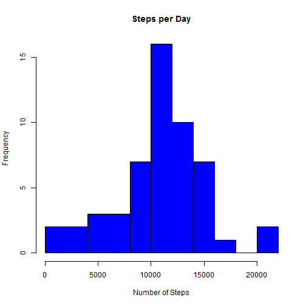
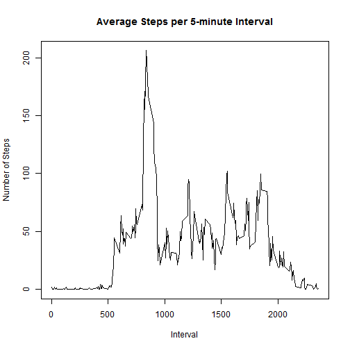
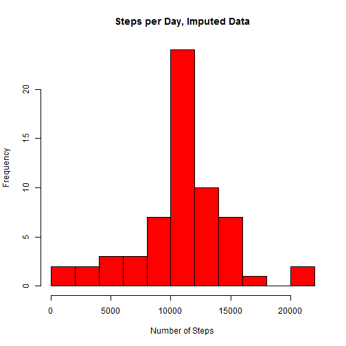
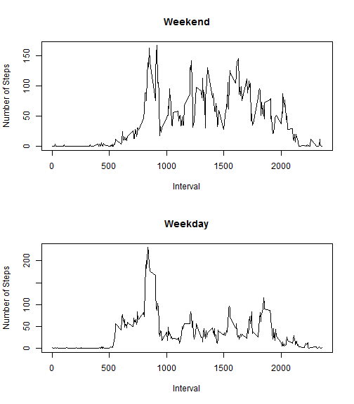

Reproducible Research -- Project 1
========================================

Make a histogram of the total number of steps taken each day

```r
activity <- read.csv("activity.csv")
hist(tapply(activity$steps, activity$date, sum), col="blue", main="Steps per Day", breaks=10, xlab="Number of Steps")
```

 

Calculate and report the mean and median total number of steps taken per day

```r
mean(tapply(activity$steps, activity$date, sum), na.rm=TRUE)
```

```
## [1] 10766.19
```

```r
median(tapply(activity$steps, activity$date, sum), na.rm=TRUE)
```

```
## [1] 10765
```

Make a time series plot of the 5-minute interval and the average number of steps taken, averaged across all days

```r
plot(unique(activity$interval), tapply(activity$steps, activity$interval, mean, na.rm=TRUE), type="l",main="Average Steps per 5-minute Interval", xlab="Interval", ylab="Number of Steps")
```

 

Which 5-minute interval, on average across all the days in the dataset, contains the maximum number of steps?

```r
match(max(tapply(activity$steps, activity$interval, mean, na.rm=TRUE)), tapply(activity$steps, activity$interval, mean, na.rm=TRUE))
```

```
## [1] 104
```

Calculate and report the total number of missing values in the dataset (i.e., the total number of rows with NAs)

```r
sum(is.na(activity$steps))
```

```
## [1] 2304
```

Create a new dataset that is equal to the original dataset but with the missing data filled in.
Strategy:  Fill in missing values with the mean for that 5-minute interval.

```r
# Create a new data frame so we don't overwrite the dataframe with the missing values
new_activity <- activity

# Calculate means for all intervals.  These will be used to populate the new data frame
mean_per_interval <- data.frame(mean_int = tapply(activity$steps, activity$interval, mean, na.rm=TRUE), 
                                interval = activity[1:288,3])

# Loop through all rows of "new_activity" and populate the missing values with the interval means
for (i in 1:nrow(new_activity)) {
        if (is.na(activity$steps[i])) {
                new_activity$steps[i] <- mean_per_interval[which(mean_per_interval$interval == activity$interval[i]),1]
        }
}
```

Make a histogram of the total number of steps taken each day

```r
hist(tapply(new_activity$steps, new_activity$date, sum), col="red", main="Steps per Day, Imputed Data", breaks=10, xlab="Number of Steps")
```

 

Calculate and report the mean and median imputed total number of steps taken per day

```r
mean(tapply(new_activity$steps, new_activity$date, sum), na.rm=TRUE)
```

```
## [1] 10766.19
```

```r
median(tapply(new_activity$steps, new_activity$date, sum), na.rm=TRUE)
```

```
## [1] 10766.19
```

The process of imputing missing data has no effect on the mean, and a modest effect on the median steps per day

Create a new factor variable in the dataset with two levels - "weekday" and "weekend" indicating whether a given date is a weekday or weekend day.

```r
for (i in 1:nrow(new_activity)) {
        if ((weekdays(as.Date(activity$date[i], format = "%Y-%m-%d")) == "Saturday") | 
                    (weekdays(as.Date(activity$date[i],format = "%Y-%m-%d")) == "Sunday")) {
                new_activity$factor[i] <- "weekend"
                } 
        else {
                new_activity$factor[i] <- "weekday"
                }
}
```

Make a panel plot containing a time series plot of the 5-minute interval and the average number of steps taken

```r
par(mfrow = c(2,1))
plot(unique(new_activity$interval), tapply(new_activity$steps[new_activity$factor == "weekend"], new_activity$interval[new_activity$factor == "weekend"], mean, na.rm = TRUE), type = "l", xlab = "Interval", ylab="Number of Steps", main = "Weekend")
plot(unique(new_activity$interval), tapply(new_activity$steps[new_activity$factor == "weekday"], new_activity$interval[new_activity$factor == "weekday"], mean, na.rm = TRUE), type = "l", xlab = "Interval", ylab="Number of Steps", main = "Weekday")
```

 

As seen above, there are differences between average weekday and average weekend activity, whereby weekday activity tends to start earlier in the day, and weekend activity tends to continue later into the evening.
